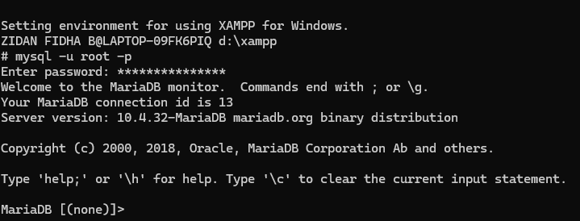
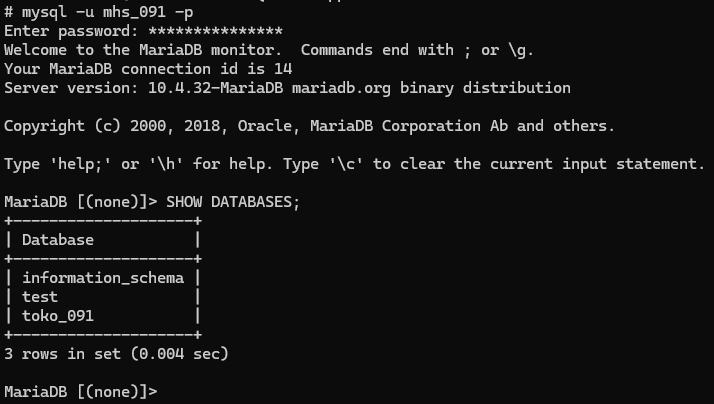
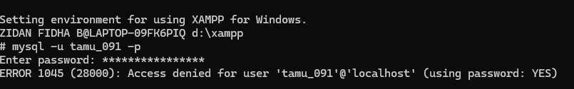
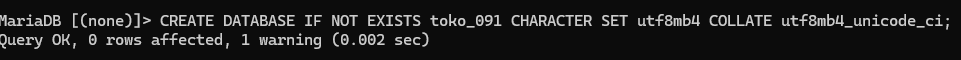
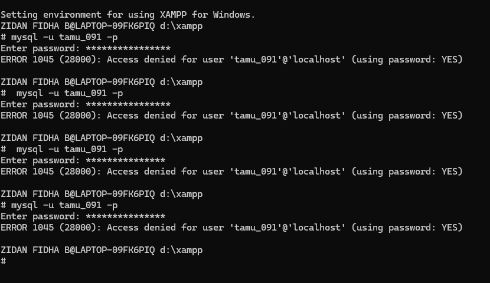
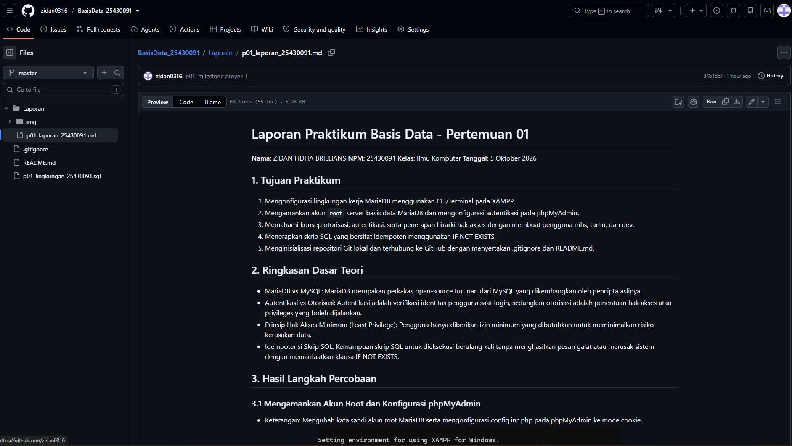

# Laporan Praktikum Basis Data - Pertemuan 01
**Nama:** ZIDAN FIDHA BRILLIANS   **NPM:** 25430091   **Kelas:** Ilmu Komputer   **Tanggal:** 5 Oktober 2026

## 1. Tujuan Praktikum
1. Mengonfigurasi lingkungan kerja MariaDB menggunakan CLI/Terminal pada XAMPP.
2. Mengamankan akun `root` server basis data MariaDB dan mengonfigurasi autentikasi pada phpMyAdmin.
3. Memahami konsep otorisasi, autentikasi, serta penerapan hirarki hak akses dengan membuat pengguna mhs, tamu, dan dev.
4. Menerapkan skrip SQL yang bersifat idempoten menggunakan IF NOT EXISTS.
5. Menginisialisasi repositori Git lokal dan terhubung ke GitHub dengan menyertakan .gitignore dan README.md.

## 2. Ringkasan Dasar Teori
* MariaDB vs MySQL: MariaDB merupakan perkakas open-source turunan dari MySQL yang dikembangkan oleh pencipta aslinya.
* Autentikasi vs Otorisasi: Autentikasi adalah verifikasi identitas pengguna saat login, sedangkan otorisasi adalah penentuan hak akses atau privileges yang boleh dijalankan.
* Prinsip Hak Akses Minimum (Least Privilege): Pengguna hanya diberikan izin minimum yang dibutuhkan untuk meminimalkan risiko kerusakan data.
* Idempotensi Skrip SQL: Kemampuan skrip SQL untuk dieksekusi berulang kali tanpa menghasilkan pesan galat atau merusak sistem dengan memanfaatkan klausa IF NOT EXISTS.

## 3. Hasil Langkah Percobaan

### 3.1 Mengamankan Akun Root dan Konfigurasi phpMyAdmin
* Keterangan: Mengubah kata sandi akun root MariaDB serta mengonfigurasi config.inc.php pada phpMyAdmin ke mode cookie.
* Tangkapan Layar: 

### 3.2 Pembuatan Basis Data & Akun Kerja
* Perintah SQL: CREATE DATABASE IF NOT EXISTS toko_091 CHARACTER SET utf8mb4 COLLATE utf8mb4_unicode_ci; dan CREATE USER IF NOT EXISTS 'mhs_091'@'localhost' IDENTIFIED BY 'DanfiMysql#2026';
* Keterangan: Berhasil membuat basis data toko_091 dan akun mhs_091 dengan hak akses penuh khusus pada basis data tersebut.
* Tangkapan Layar: 

## 4. Jawaban Titik Analisis
* Titik Analisis 1: Server yang berjalan pada XAMPP adalah MariaDB (v10.4.32). Dokumentasi MySQL tetap relevan untuk sintaks ANSI SQL dasar, namun dokumentasi MariaDB wajib dirujuk saat menangani fitur spesifik mesin penyimpanan atau plugin autentikasi.
* Titik Analisis 2: Saat masuk dengan mysql -u root tanpa -p, galat yang muncul adalah ERROR 1045 (28000) karena klien mencoba terhubung tanpa mengirimkan kata sandi.
* Titik Analisis 3: Akun mhs_091 dapat melihat information_schema karena berisi katalog sistem standar yang boleh dibaca pengguna terautentikasi. Perbedaannya, ERROR 1045 terjadi saat gagal login, sedangkan ERROR 1044 terjadi saat gagal otorisasi ke basis data tertentu.
* Titik Analisis 4: Mode cookie pada phpMyAdmin menuntut autentikasi ulang via formulir login per sesi peramban sehingga kredensial aman dari penyimpanan plain-text.

## 5. Hasil Latihan dan Modifikasi
* Latihan E.1 (Pengujian Akun Tamu): Akun tamu_091 dibuat dengan hak akses SELECT. Saat mencoba perintah CREATE TABLE uji (id INT); server menolak dengan galat ERROR 1142 (42000): CREATE command denied, menandakan akun tamu tidak memiliki hak otorisasi DDL. Tangkapan Layar: 
* Latihan E.2 (Skrip Idem-poten): Menambahkan klausa IF NOT EXISTS pada perintah CREATE DATABASE dan CREATE USER di berkas SQL. Skrip berhasil diuji dengan dieksekusi dua kali berturut-turut tanpa galat duplikasi. Tangkapan Layar: 

## 6. Tugas Mandiri: Milestone Proyek 1
* Berhasil membuat basis data proyek toko_daring_091 dan akun pengembang dev_091. Terbukti tidak dapat membuka basis data lain dan menghasilkan ERROR 1044 (42000). Tangkapan Layar: 
* Berhasil membuat README.md dan berkas .gitignore untuk mengecualikan berkas rahasia.

## 7. Pembahasan dan Kendala
* Kendala: Akses phpMyAdmin sempat terhenti setelah mengubah kata sandi root.
* Solusi: Mengubah tipe autentikasi menjadi cookie di berkas config.inc.php dan merestart service MySQL pada XAMPP.

## 8. Kesimpulan
Seluruh rangkaian praktikum Modul 1 berhasil dilaksanakan dengan baik, mulai dari konfigurasi keamanan server MariaDB, penerapan hak akses, hingga pengunggahan kode dan laporan ke GitHub.

## 9. Pernyataan Penggunaan AI
Penggunaan asisten AI dimanfaatkan untuk membantu menyusun struktur laporan Markdown agar sesuai dengan format baku institusi serta merapikan penjelasan teknis. Seluruh eksekusi perintah dilakukan secara mandiri.

## 10. Bukti Git
* Tautan Repositori: https://github.com/zidan/basisdata-25430091
* Tangkapan Layar Repositori: 

## Checklist
- [x] Mengamankan akun root MariaDB dengan kata sandi kuat
- [x] Memunculkan galat ERROR 1045 saat login tanpa kata sandi
- [x] Mengubah autentikasi phpMyAdmin ke mode cookie
- [x] Membuat basis data toko_091 dan akun mhs_091
- [x] Memunculkan galat ERROR 1044 saat akses basis data tanpa izin
- [x] Membuat akun tamu_091 dan memunculkan galat ERROR 1142 (CREATE TABLE)
- [x] Memastikan skrip SQL bersifat idempoten (IF NOT EXISTS)
- [x] Membuat basis data proyek toko_daring_091 dan akun dev_091
- [x] Membuktikan isolasi akun dev_091 dari basis data lain
- [x] Membuat berkas README.md memuat Identitas Proyek dan Lingkup Layanan
- [x] Membuat berkas .gitignore yang mengecualikan berkas rahasia
- [x] Melakukan commit dan push ke GitHub