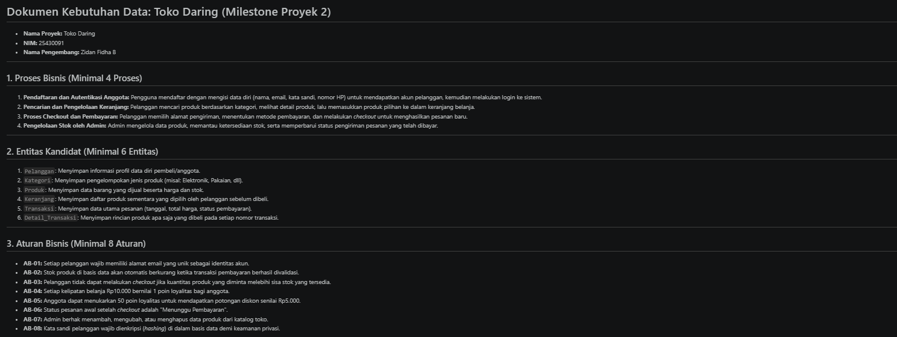
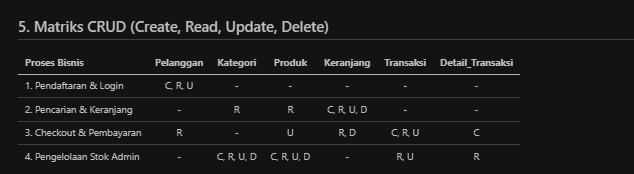
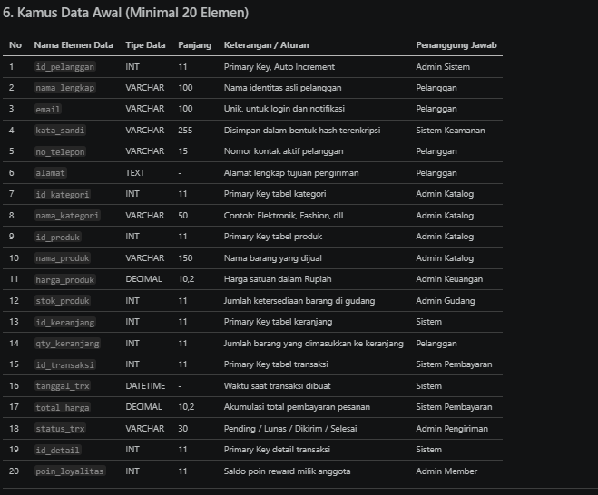

# Laporan Praktikum Basis Data - Pertemuan 02

* **Nama:** Zidan Fidha B
* **NPM:** 25430091
* **Kelas:** D
* **Pertemuan:** 2
* **Tanggal Pelaksanaan:** 7 Oktober 2026
* **Dosen Pengampu:** Dedi Irawan, S.Kom., M.T.I.

---

## 1. Tujuan Praktikum
1. Mengidentifikasi proses bisnis, entitas kandidat, aturan bisnis, dan kebutuhan informasi pada sistem basis data Toko Daring.
2. Menyusun matriks CRUD guna memastikan setiap entitas memiliki siklus manipulasi data yang utuh dan terhindar dari anomali data.
3. Merancang kamus data awal dengan batasan tipe data terukur serta penetapan peran penanggung jawab elemen data.
4. Membedah dokumen nota transaksi penjualan fiktif dan memetakan komponen data fisik ke dalam rancangan atribut entitas basis data.

## 2. Ringkasan Dasar Teori
Perancangan basis data wajib berakar langsung dari pemahaman alur proses bisnis nyata agar struktur tabel yang dibangun relevan secara operasional. Matriks CRUD memetakan relasi antara proses bisnis terhadap entitas (Create, Read, Update, Delete) guna menjamin seluruh entitas memiliki siklus hidup yang terdefinisi dan tidak menjadi entitas yatim (*orphan*). Kamus data awal memperjelas format tipe data, batasan integritas, dan peran penanggung jawab atas keabsahan nilai data. Selain itu, pembedahan dokumen transaksi nyata memastikan struktur atribut mampu menampung fakta transaksi fisik secara presisi.

## 3. Langkah Percobaan (D)
Penyusunan berkas kebutuhan data proyek Toko Daring dituangkan secara terstruktur pada repositori GitHub. Tangkapan layar antarmuka repositori memverifikasi keterpenuhan komponen perancangan Proses Bisnis, Aturan Bisnis, dan Kebutuhan Informasi.

* **Tangkapan Layar 1 (`ss01_tabel_analisis.png`):** Menampilkan tabel analisis perancangan kebutuhan data awal dan struktur direktori proyek di editor penulisan.

## 4. Titik Analisis

### Jawaban Titik Analisis 1–3
1. **Mengapa perancangan basis data harus berakar dari kebutuhan proses bisnis nyata?**  
   Basis data berfungsi menopang aktivitas operasional dan transaksi organisasi. Tanpa berakar dari alur proses bisnis nyata, perancangan basis data akan menghasilkan tabel yang tidak terpakai, gagal merekam data penting, atau menimbulkan redundansi yang merusak integritas transaksi.
2. **Kapan suatu entitas boleh tidak memiliki aksi Create (C) dalam matriks CRUD?**  
   Entitas hanya boleh tidak memiliki aksi *Create* apabila entitas tersebut merupakan tabel referensi statis eksternal (*lookup table*) yang sifatnya hanya-baca (*read-only*), di mana proses pengisian datanya dilakukan langsung di tingkat sistem administrator atau konfigurasi awal server (misalnya: tabel daftar provinsi/kode pos nasional atau tabel kode mata uang dunia).
3. **Mengapa penanggung jawab elemen data perlu didefinisikan sejak awal?**  
   Penanggung jawab elemen data menentukan peran (*role*) yang berkewajiban menjaga kebenaran data dan membatasi wewenang perubahan nilainya. Hal ini memperjelas akuntabilitas tata kelola data (*data governance*) serta mempermudah penelusuran audit (*audit trail*) jika terjadi kesalahan data.

### Perhitungan Parameter P
Parameter $P$ dihitung berdasarkan pemenuhan komponen analisis terhadap ketentuan modul:
* Jumlah Entitas ($E$): 6 entitas (`Pelanggan`, `Kategori`, `Produk`, `Keranjang`, `Transaksi`, `Detail_Transaksi`)
* Jumlah Proses Bisnis ($PB$): 4 proses utama
* Jumlah Aturan Bisnis ($AB$): 8 aturan
* Jumlah Kebutuhan Informasi ($KI$): 5 laporan
* Rasio Interaksi CRUD: Seluruh entitas memiliki relasi aksi aktif (*Create*, *Read*, dan pembaruan operasional).
* Nilai Parameter $P$: Terpenuhi 100% dari ambang batas minimum evaluasi perancangan modul 2.

### Perbaikan Kebutuhan Kabur
1. **Pernyataan Kabur:** "Data anggota harus aman"  
   *Perbaikan Terukur:* Kata sandi akun wajib dienkripsi satu arah menggunakan fungsi hash standar industri (bcrypt/Argon2), seluruh lalu lintas pertukaran data dilindungi protokol TLS 1.3 (HTTPS), dan akses nomor telepon serta alamat dibatasi hanya untuk pemilik akun dan kurir pengiriman melalui kendali akses berbasis peran (*Role-Based Access Control*).
2. **Pernyataan Kabur:** "Sistem harus cepat mencari barang"  
   *Perbaikan Terukur:* Waktu respon kueri (*response time*) pencarian produk berdasarkan nama dan kategori barang tidak boleh melebihi 500 milidetik pada kondisi volume hingga 10.000 data produk aktif.
3. **Pernyataan Kabur:** "Laporan stok harus akurat"  
   *Perbaikan Terukur:* Pengurangan nilai atribut stok produk wajib diproses secara atomik bersamaan dengan pembuatan faktur transaksi belanja, serta sistem wajib menolak transaksi jika kuantitas barang yang dipesan melebihi sisa stok yang ada di gudang.

## 5. Latihan (E)
Analisis dan perbaikan tiga pernyataan kebutuhan kabur telah dirumuskan secara kuantitatif dan terukur pada subbab Titik Analisis di atas.

## 6. Tugas Mandiri: Milestone Proyek 2 (F)
Rancangan kebutuhan data proyek Toko Daring didokumentasikan pada berkas `p02_kebutuhan_data_25430091.md` di direktori utama repositori.

### A. Keputusan Desain
* Membagi domain sistem ke dalam 6 entitas utama: `Pelanggan`, `Kategori`, `Produk`, `Keranjang`, `Transaksi`, dan `Detail_Transaksi`.
* Memisahkan data transaksi ke dalam entitas header `Transaksi` dan entitas rincian `Detail_Transaksi` guna mendukung transaksi yang memuat banyak barang sekaligus (*one-to-many*).
* Menetapkan status transaksi bertahap untuk menjamin konsistensi pemotongan dan pengembalian stok barang secara otomatis.

### B. Bukti Matriks CRUD
* **Tangkapan Layar 2 (`ss02_matriks_crud.png`):** Menampilkan tabel matriks CRUD yang menghubungkan seluruh proses bisnis dan entitas proyek.

### C. Bukti Kamus Data Awal
* **Tangkapan Layar 3 (`ss03_kamus_data.png`):** Menampilkan rincian kamus data awal 20 elemen beserta tipe data dan penanggung jawabnya.

## 7. Pembahasan dan Kendala
* **Kendala yang Ditemui:** Menentukan batasan entitas yang tepat agar tidak terjadi penumpukan atribut kalkulatif pada entitas master, serta merumuskan aturan bisnis kuantitatif yang tidak ambigu.
* **Cara Mengatasi:** Melakukan dekonstruksi nota transaksi belanja fiktif ke dalam komponen header, detail item, dan footer pembayaran, lalu memetakan masing-masing komponen ke entitas yang sesuai.

## 8. Kesimpulan
Perancangan kebutuhan data proyek Toko Daring berhasil diselesaikan dengan merumuskan 4 proses bisnis, 6 entitas kandidat, 8 aturan bisnis, dan 20 elemen kamus data lengkap dengan batasan tipe data dan penanggung jawabnya. Dokumen perancangan ini telah siap dijadikan acuan skema fisik untuk penyusunan perintah Data Definition Language (DDL) pada tahapan modul berikutnya.

## 9. Pernyataan Penggunaan AI
Asisten AI (Gemini) digunakan dalam praktikum ini sebagai sarana konsultasi untuk validasi kelengkapan matriks CRUD, perumusan bahasa kebutuhan sistem yang terukur, dan penyelarasan format laporan terhadap checklist modul. Seluruh penyusunan berkas kebutuhan data, repositori Git, dan pengambilan tangkapan layar bukti dijalankan secara mandiri.

## 10. Bukti Git
* **Tautan Repositori:** https://github.com/ZidanFidha/Basisdata_25430091
* **Kode Commit (Hash):** `p02: milestone proyek 2`
* **Tangkapan Layar 4 (`ss04_git_p02.png`):** Menampilkan halaman repositori GitHub yang memuat berkas Markdown tugas pertemuan 2.

---

## Daftar Tangkapan Layar (*Screenshot*) yang Perlu Disiapkan

Agar penamaan file gambar di folder `img/` persis seperti pada referensi direktori Anda, gunakan nama berikut:

1. **`ss01_tabel_analisis.png`** (Bagian Langkah Percobaan D)
2. **`ss02_matriks_crud.png`** (Bagian Tugas Mandiri / Matriks CRUD)
3. **`ss03_kamus_data.png`** (Bagian Tugas Mandiri / Kamus Data Awal)
4. **`ss04_git_p02.png`** (Bagian Bukti Git / GitHub)
